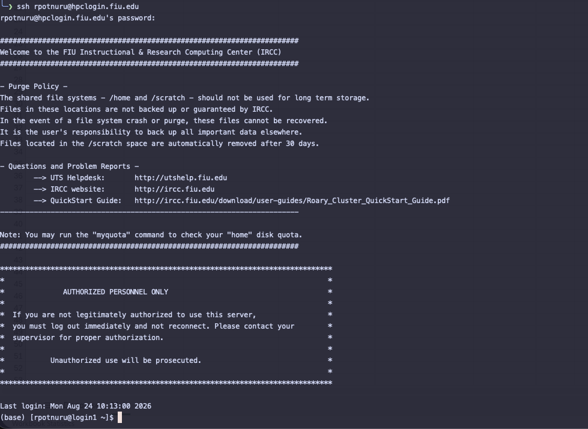

# Connecting to Roary

Roary can be accessed in two primary ways: through a traditional SSH terminal or through the browser-based Open OnDemand portal.

<div class="connect-access-grid">

  <div class="connect-access-card">

    <span class="connect-access-code">
      SSH
    </span>

    <strong>
      Command-Line Access
    </strong>

    <p>
      Connect directly to Roary using a terminal from Windows,
      macOS, or Linux.
    </p>

    <code>ssh USERNAME@hpclogin.fiu.edu</code>

    <a href="#ssh-access">
      SSH instructions →
    </a>

  </div>


  <div class="connect-access-card connect-access-ood">

    <span class="connect-access-code">
      OOD
    </span>

    <strong>
      Open OnDemand
    </strong>

    <p>
      Access Roary through your web browser using files,
      shells, jobs, and interactive applications.
    </p>

    <code>https://hpclogin.fiu.edu\</code\>

    <a
      href="https://hpclogin.fiu.edu"
      target="_blank"
      rel="noopener">
      Open OnDemand ↗
    </a>

  </div>

</div>


## SSH Access

SSH stands for **Secure Shell**. It provides an encrypted command-line connection between your computer and the Roary environment.

<div class="ssh-command-panel">

  <div>

    <span class="roary-page-eyebrow">
      ROARY LOGIN
    </span>

    <h3>
      Connect to hpclogin.fiu.edu
    </h3>

    <p>
      Replace <strong>USERNAME</strong> with your FIU/HPC username.
    </p>

  </div>

  <div class="ssh-command-box">

```bash
ssh USERNAME@hpclogin.fiu.edu
```

  </div>

</div>


### Example

If your FIU username were `abc123`, you would connect with:

```bash
ssh abc123@hpclogin.fiu.edu
```

!!! note

    Use your own FIU/HPC username in place of `abc123`.


## Choose Your Operating System

<div class="connect-os-grid">

  <a class="connect-os-card" href="windows.md">

    <span class="connect-os-code">
      WIN
    </span>

    <strong>
      Windows
    </strong>

    <p>
      Connect using Windows Terminal or PowerShell.
    </p>

    <small>
      View instructions →
    </small>

  </a>


  <a class="connect-os-card" href="macos.md">

    <span class="connect-os-code">
      MAC
    </span>

    <strong>
      macOS
    </strong>

    <p>
      Connect using the built-in Terminal application.
    </p>

    <small>
      View instructions →
    </small>

  </a>


  <a class="connect-os-card" href="linux.md">

    <span class="connect-os-code">
      LINUX
    </span>

    <strong>
      Linux
    </strong>

    <p>
      Connect using the OpenSSH client from a terminal.
    </p>

    <small>
      View instructions →
    </small>

  </a>

</div>

## Successful SSH Login

After entering your credentials, a successful connection displays the
Roary login banner and gives you a shell prompt on the login environment.

<figure markdown="span">

  

  <figcaption>
    Example of a successful SSH connection to Roary through hpclogin.fiu.edu.
  </figcaption>

</figure>

If you see the Roary login banner followed by a shell prompt, your SSH
connection was successful.

## What Happens When You Connect?

When you run:

```bash
ssh USERNAME@hpclogin.fiu.edu
```

your computer establishes an encrypted SSH session with the Roary access environment.

<div class="ssh-connect-flow">

  <div class="ssh-flow-node">

    <span>
      01
    </span>

    <strong>
      Your Computer
    </strong>

    <small>
      Windows / macOS / Linux
    </small>

  </div>


  <div class="ssh-flow-connection">

    <small>
      SSH
    </small>

    <div class="ssh-flow-line"></div>

    <span>
      →
    </span>

  </div>


  <div class="ssh-flow-node ssh-flow-roary">

    <span>
      02
    </span>

    <strong>
      hpclogin.fiu.edu
    </strong>

    <small>
      Roary access environment
    </small>

  </div>


  <div class="ssh-flow-connection">

    <small>
      SLURM
    </small>

    <div class="ssh-flow-line"></div>

    <span>
      →
    </span>

  </div>


  <div class="ssh-flow-node">

    <span>
      03
    </span>

    <strong>
      Compute Resources
    </strong>

    <small>
      CPU / Memory / GPU
    </small>

  </div>

</div>

Logging in gives you access to the environment used to prepare files, manage software, and submit jobs.

Computational workloads themselves should run through Slurm on compute resources.


## First SSH Connection

The first time you connect from a computer, SSH may display a message similar to:

```text
The authenticity of host 'hpclogin.fiu.edu' can't be established.
Are you sure you want to continue connecting (yes/no/[fingerprint])?
```

This is SSH asking whether you trust the host key for the system you are connecting to.

Make sure the hostname shown is:

```text
hpclogin.fiu.edu
```

before continuing.


## Open OnDemand

If you prefer browser-based access, open:

[https://hpclogin.fiu.edu](https://hpclogin.fiu.edu){ target="_blank" }

Open OnDemand provides browser access to Roary features such as:

<div class="ood-feature-grid">

  <div class="ood-feature">
    <span>FILES</span>
    <strong>File Management</strong>
  </div>

  <div class="ood-feature">
    <span>SHELL</span>
    <strong>Terminal Access</strong>
  </div>

  <div class="ood-feature">
    <span>JOBS</span>
    <strong>Job Monitoring</strong>
  </div>

  <div class="ood-feature">
    <span>APPS</span>
    <strong>Interactive Applications</strong>
  </div>

</div>

For full browser-access instructions, see:

[Open OnDemand Guide :material-arrow-right:](open-ondemand.md){ .md-button .md-button--primary }


<div class="connect-login-warning">

  <div class="connect-warning-mark">
    !
  </div>

  <div>

    <span class="roary-page-eyebrow">
      IMPORTANT
    </span>

    <h3>
      Connecting to Roary does not allocate compute resources
    </h3>

    <p>
      The login environment is intended for preparing your work,
      managing files, loading software, compiling code, and submitting jobs.
    </p>

    <p>
      CPU-intensive, memory-intensive, long-running, and GPU workloads
      should be submitted through Slurm.
    </p>

    <a href="login-vs-compute.md">
      Learn about login and compute nodes →
    </a>

  </div>

</div>


## Need Help Connecting?

If you have an active HPC account but cannot connect to Roary, email the HPC Admins:

[**hpcadmin@fiu.edu**](mailto:hpcadmin@fiu.edu)

When requesting help, include:

- Your HPC username
- Whether you are using SSH or Open OnDemand
- Your operating system
- The complete error message

Never send your password.


## Next Step

[Understand Login and Compute Nodes :material-arrow-right:](login-vs-compute.md){ .md-button .md-button--primary }


